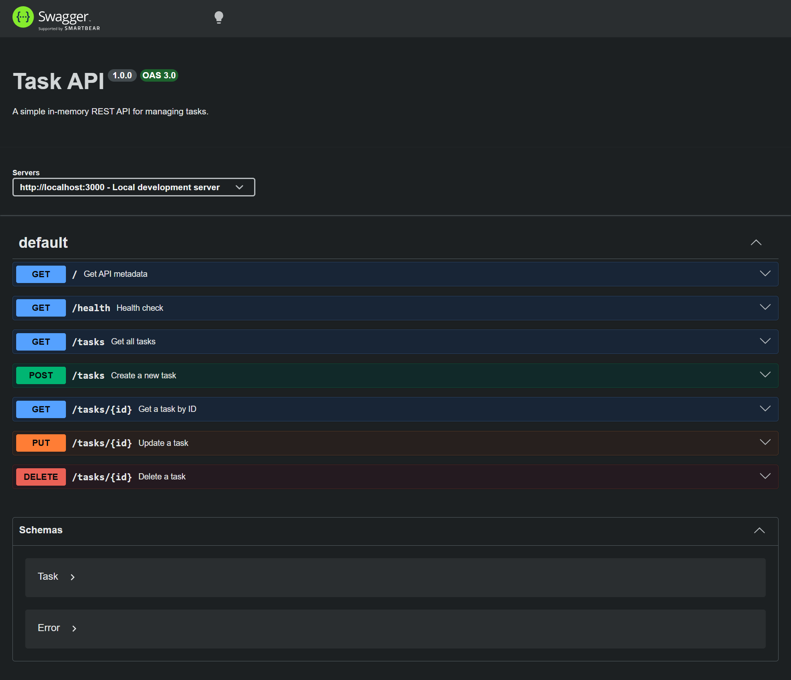

# Task API

A simple in-memory REST API for managing tasks built with Node.js and Express.

## Features

- Create tasks
- Read all tasks
- Read a single task
- Update tasks
- Delete tasks
- Input validation
- 404 handling
- Swagger UI documentation
- Filter tasks by completion status
- Search tasks by title

## Tech Stack

- JavaScript
- Node.js
- Express
- Swagger UI
- OpenAPI
- In-memory data storage

## Installation

### 1. Clone the repository

```bash
git clone https://github.com/ShowravKormokar/fly-rank-ai-intern.git
```

### 2. Enter the project directory

```bash
cd task-api
```

### 3. Install dependencies

```bash
npm install
```

## Run the Server

```bash
npm start
```

The server runs at:

```
http://localhost:3000
```

## Swagger UI

Interactive API documentation is available at:

```
http://localhost:3000/docs
```

Swagger UI allows you to inspect and test all endpoints directly from the browser.

## Endpoints

| Method | Endpoint     | Description          |
| ------ | ------------ | -------------------- |
| GET    | `/`          | API metadata         |
| GET    | `/health`    | Health check         |
| GET    | `/tasks`     | Get all tasks        |
| GET    | `/tasks/:id` | Get one task         |
| POST   | `/tasks`     | Create a task        |
| PUT    | `/tasks/:id` | Update a task        |
| DELETE | `/tasks/:id` | Delete a task        |

### Optional query parameters for `GET /tasks`

| Parameter | Type    | Description                              |
| --------- | ------- | ---------------------------------------- |
| `done`    | boolean | Filter tasks by completion status        |
| `search`  | string  | Search task titles (case-insensitive)    |

Examples:

```text
GET /tasks?done=true
GET /tasks?done=false
GET /tasks?search=milk
GET /tasks?done=true&search=milk
```

## Request Examples

### Create a task

```bash
curl -i -X POST http://localhost:3000/tasks \
  -H "Content-Type: application/json" \
  -d "{\"title\":\"Buy milk\"}"
```

### Read all tasks

```bash
curl -i http://localhost:3000/tasks
```

### Read a single task

```bash
curl -i http://localhost:3000/tasks/1
```

### Update a task

```bash
curl -i -X PUT http://localhost:3000/tasks/1 \
  -H "Content-Type: application/json" \
  -d "{\"done\":true}"
```

### Delete a task

```bash
curl -i -X DELETE http://localhost:3000/tasks/1
```

## Example Response

```text
$ curl -i http://localhost:3000/health

HTTP/1.1 200 OK
X-Powered-By: Express
Content-Type: application/json; charset=utf-8
Content-Length: 15
ETag: W/"f-VaSQ4oDUiZblZNAEkkN+sX+q3Sg"
Date: Fri, 18 Sep 2026 11:48:18 GMT
Connection: keep-alive
Keep-Alive: timeout=5

{"status":"ok"}
```

## Swagger UI



## HTTP Status Codes

- `200 OK` — successful read or update
- `201 Created` — task successfully created
- `204 No Content` — task successfully deleted
- `400 Bad Request` — invalid request data
- `404 Not Found` — requested task does not exist

## Data Storage

The API uses an in-memory array for task storage. Data is reset when the server restarts.

## Project Structure

```
task-api/
├── screenshots/
│   └── swagger-ui.png
├── .gitignore
├── openapi.json
├── package.json
├── package-lock.json
├── README.md
└── server.js
```

## Git History

```text
baaef22 Stage 6: publish and docs
a171180 Stage 7: add task filtering and search
228edef Stage 5: Swagger UI
4e9f308 Stage 4: full CRUD
50aef34 Stage 3: create with validation
2576e6f Stage 2: read endpoints with 404
42f5cf4 Stage 1: root and health endpoints
4aa4337 Stage 0: hello server
```

## AI vs Me

This section documents a refactor comparison between my original implementation and an AI-proposed suggestion. The goal was to identify meaningful differences, understand trade-offs, and decide which changes (if any) were worth adopting.

### What I asked AI to do

I asked an independent AI reviewer to propose a reasonable refactor of the Task API that would improve readability, maintainability, or code organization while keeping API behavior unchanged, using in-memory data only, and staying appropriate for a beginner-level CRUD API.

### What AI suggested

The AI proposal focused on removing duplication and clarifying validation:

1. **Extract a `taskNotFoundError` helper** — the 404 error message was duplicated 3 times (GET /tasks/:id, PUT /tasks/:id, DELETE /tasks/:id).
2. **Extract an `isValidTitle` helper** — the title validation logic (typeof check + trim + empty check) was duplicated in POST and PUT.
3. **Simplify ID generation** — replace the ternary with a `reduce`-based one-liner.
4. **Extract a `filterTasks` helper** — move the query-parameter filtering logic out of the GET /tasks route into a separate function.
5. **Use named constants for error strings** — define error messages as named constants at the top of the file.

### What I learned

The comparison showed that my original implementation was already clean and correct, but it had some duplication. The most valuable suggestions were the ones that removed repeated code without adding structure. The least valuable suggestions were the ones that introduced new patterns (like a return-value object for filtering) for features that only exist in one place.

The key learning was that "better" does not always mean "more structured." For a small educational project, readability and minimalism often matter more than abstract architecture.

### What I adopted

**Adopted: `taskNotFoundError` helper**

The 404 error message `Task ${id} not found` was repeated 3 times. Extracting it into a single helper function makes the code DRY and ensures the message stays consistent if it ever needs to change. This change does not affect API behavior.

**Adopted: `isValidTitle` helper**

The title validation logic (typeof check + trim + empty check) was duplicated in POST and PUT. A shared helper removes this duplication and makes the intent clearer. This change does not affect API behavior.

### What I rejected

**Rejected: `reduce`-based ID generation**

The AI suggested replacing `tasks.length > 0 ? Math.max(...) + 1 : 1` with `tasks.reduce((max, t) => Math.max(max, t.id), 0) + 1`. While more concise, the reduce version is less obvious to a beginner because it hides the empty-array edge case. The current ternary is explicit and easy to understand, which matters more for this assignment.

**Rejected: `filterTasks` helper function**

The AI suggested extracting the query-parameter filtering logic into a separate function that returns either an array or an error object. This would improve testability in theory, but it introduces a return-value pattern (`{ error }`) for a feature that only exists in one route. For a beginner assignment, the inline version is clearer and does not require the reader to understand a new error-propagation pattern.

**Rejected: Named constants for error strings**

With only one validation message (`'done must be true or false'`), defining it as a named constant is overkill. This would only become valuable if more validation messages were added later.